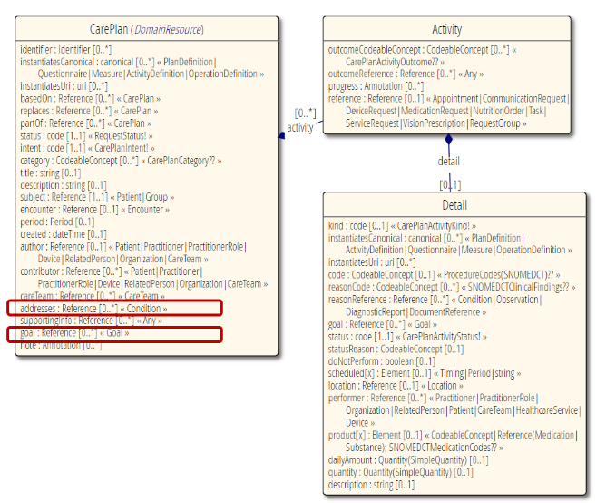
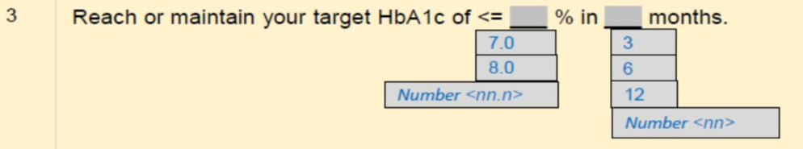

# HSAR Health Plan validation

## HealthPlan Data Model - CarePlan Resource

HL7 FHIR resources provides future proof data model to support evolving business requirements.

- R4B FHIR version CarePlan resource to represent the Healthier SG HealthPlan
- Key Data Elements:
  - **Address**: resident's condition(s) to be addressed
  - **Goal**: the goal of the Health Plan, represneted as contained resource, not allow individual goal to be updated
  - **Activity** and **Detail**: the planned activity and detailed information, e.g. the recommended next check-in date
- Resource Profile: Update FHIR resource profile validation When new goal or activity to be added, no code change is required.

## Resource Profile Validation Example - Goal 3: Hba1c

Goal Details:

__this screenshot is outdated__

- **Goal**: Hba1c < 7%

## User Story: add new goal mental health goal

As a Healthier SG user, I want to add a new mental health goal to the Health Plan, so that I can track my mental health progress.

Copilot Prompt:
Expressing a Mental Health Goal in FHIR, generate the goal 9 structure definition for the new goal resource profile with below goal measurement:

REQUIREMENT:
- Goal Measure GM016, the practice duration range from 10 to 30 minutes.
Practice at least {10} minutes of guided meditation or deep breathing (morning and evening).
- Goal Measure GM017, the engage in physical activity duration range from 30 to 60 minutes.
Engage in {30} minutes of physical activity (walking, yoga, or any preferred exercise).
- Goal Measure GM018, the screen time limit at 20 minutes before bed.
Limit screen time at {20} mins before bed to enhance sleep quality.
- The Goal Measure GM016, GM017, GM018 are part of the Goal 9.

OUTCOME:
1. Define the "G9" at CodeSystem https://synapxe.sg/ValueSet/hsg-health-goal
2. Define the 3 new goal measure at CodeSystem https://synapxe.sg/ValueSet/hsg-goal-measure
3. Generate Goal 9 structure definition file with slicing for the new goal measure.
4. Generate a sample payload for the new goal resource profile.